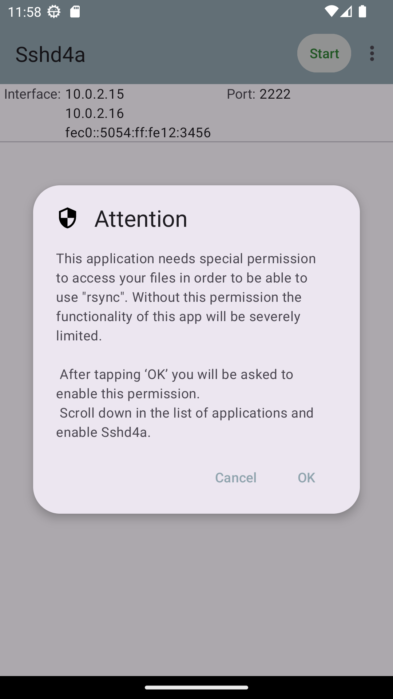
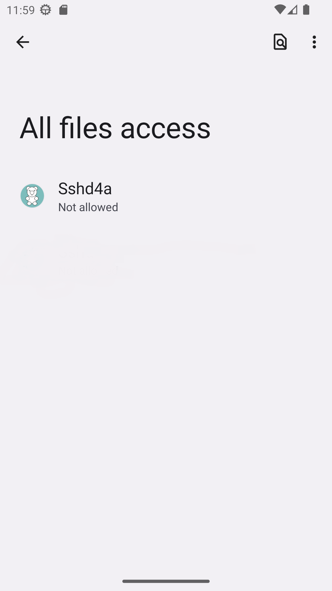
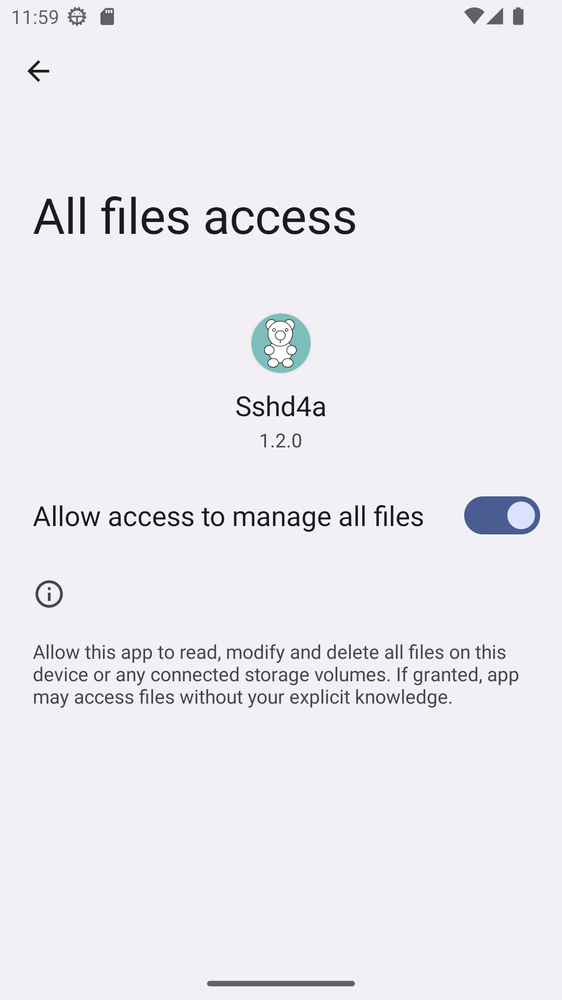

Provides an 'sshd' server with shell access, rsync and scp/sftp services.

Some documentation can be found on the [wiki](https://github.com/tfonteyn/Sshd4a/wiki)

### Download the latest release: 1.3.0

## Services:

Services are provided by:
- https://matt.ucc.asn.au/dropbear/dropbear.html
- https://rsync.samba.org/
- https://github.com/openssh/openssh-portable

The latest release contains:
- Dropbear 2024.85
- rsync 3.3.0
- sftp-server from OpenSSH 9.8p1

## Device support:

- Requires minimal Android 11 (API 30)
- Supported/tested up to Android 14 (API 34).

## Android Permissions:

- android.permission.POST_NOTIFICATIONS
- android.permission.FOREGROUND_SERVICE
- android.permission.FOREGROUND_SERVICE_SPECIAL_USE

These are standard permissions required by Android to be able to run sshd as a service.
It will allow the service to keep running, while you switch to other apps.

- android.permission.RECEIVE_BOOT_COMPLETED

Another standard permission which is needed to be able to start the service at device boot.
You can enable/disable this in the app settings.

- android.permission.MANAGE_EXTERNAL_STORAGE

You will be requested to grant this permission.
It is needed to be able to effectively use the "rsync" and "sftp" commands.
Without it, you would only be able to access the app's embedded "files" directory.

As rsync is of course a means to make a private backup/sync of the files on your device,
there is a need to give the app special permission to access **all** files.

This must be (and is) explicitly requested when the app is run, and involves you to open
the device settings and manually give this permission. The app can only prompt you for this,
and you **must** do this **manually**. You can of course deny/ignore this request
if accessing the app embedded "files" directory is enough for your needs.

More info on MANAGE_EXTERNAL_STORAGE can be found in this
[Android doc article](https://developer.android.com/training/data-storage#permissions)
and in this
[Google article](https://support.google.com/googleplay/android-developer/answer/9888170?hl=en) 
in the section "All Files Access Permission"

## Thanks

- Chinese translation provided by [yzqzss](https://github.com/yzqzss)

- Inspired by, and uses parts of the native C code from
http://www.galexander.org/software/simplesshd/